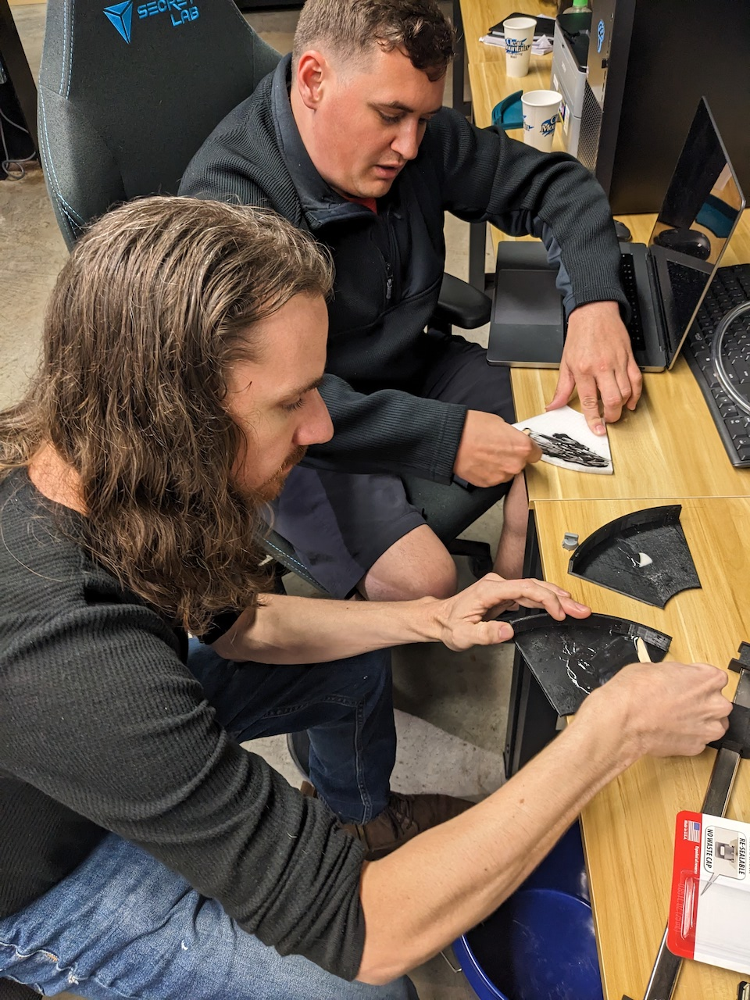

# Hydroponics with Raspberry Pi
Docs 3-4-23 V1 (For questions or comments:  Stephen Witty switty@level500.com)  

### Project Overview:
This project is a work in progres exploring the usage of the Raspberry Pi and sensors to automate a Hydroponics system.  The project is a group collaboration effort between @switty, @WW and @vetch.  We intend to use soil sensors to monitor moisture levels across the system. When needed the system will automatically supply water via a pump controlled via electronic relay.  We will also explore the usage of other sensor types and methodologies.  Data for analysis and reporting will be sent via Bluetooth relay to a Helium LoRa MCU which will publish the data to a backend website.  

### Many thanks:

- The Mycelium Networks Builder Program for support and encouragement
- RAK Wisblock for excellent hardware offerings and code examples
- The Raspberry Pi Foundation
- The various groups supporting and maintaining the Helium network

 &nbsp; &nbsp; &nbsp; &nbsp; &nbsp; &nbsp;

### Demo video:
https://youtu.be/F8CLZTvz4Z0

